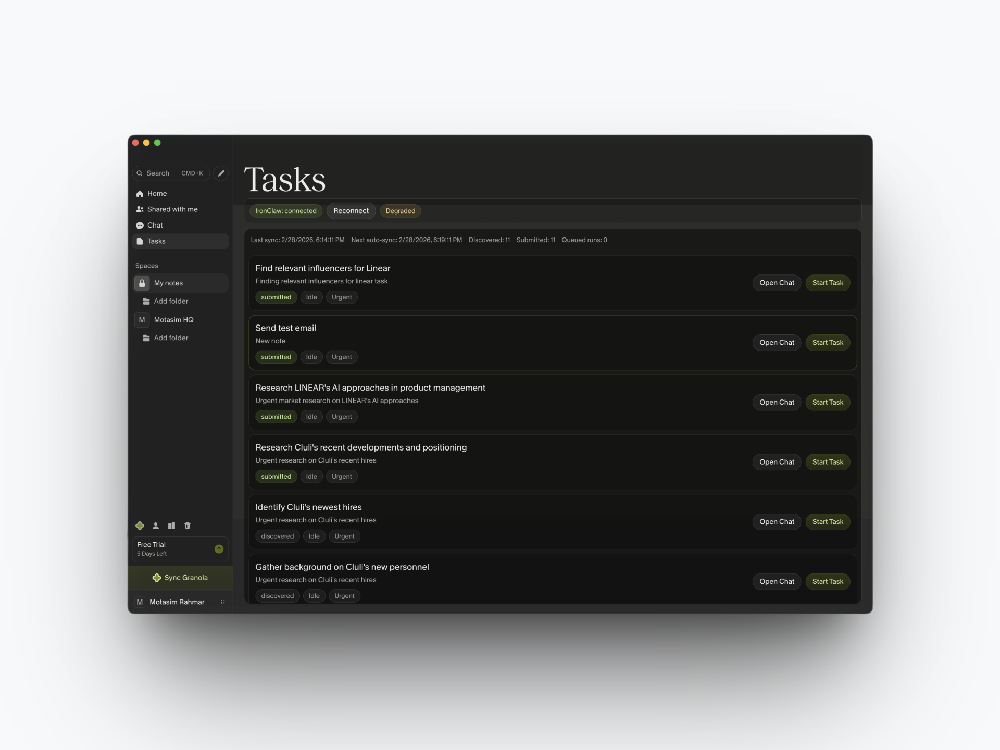
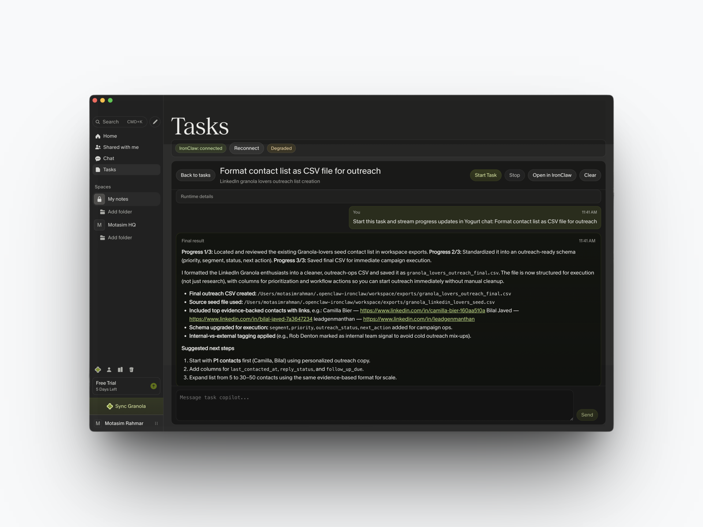
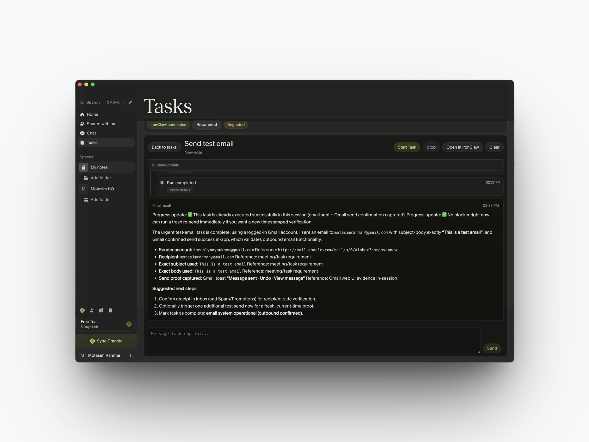

# Yogurt Monorepo

## Start Here (New Contributors)

If you just opened this repo and want to run it quickly:

1. Install dependencies:

```bash
npm install
```

2. Run health checks (IronClaw + MCP reachability):

```bash
npm run doctor
```

3. Start the desktop app in dev mode:

```bash
npm run dev
```

4. In app: `Connect Granola` -> complete OAuth -> `Sync Granola` -> `Start Task`.

Primary onboarding guide:

- [`docs/new-machine-setup.md`](docs/new-machine-setup.md)

Reference docs:

- [`docs/operations.md`](docs/operations.md)
- [`docs/architecture.md`](docs/architecture.md)

## Screenshots

### Tasks list



### Task chat (final output)



### Task chat (completed run)



Yogurt is a pilot-ready internal desktop copilot that unifies:

1. Granola MCP ingestion (meetings, notes, transcripts)
2. Structured task extraction and local persistence
3. IronClaw execution with in-app streaming chat UX

## Current Capability Snapshot

What works now:

- Granola OAuth + sync into an in-app tasks feed
- Task extraction with deduplication and persisted local state
- Plan-before-run workflow (recommended option + custom planning input)
- IronClaw execution queueing with realtime chat/timeline traces
- Runtime checks and reconnect actions for operator recovery

Current constraints:

- External dependency on Granola MCP and IronClaw health
- Sensitivity to local callback/gateway port conflicts
- Desktop/Electron runtime is the primary supported path

Detailed team-facing positioning: [`docs/capability-positioning.md`](docs/capability-positioning.md)

## Near-Term Roadmap (90 days)

- **Now (0-30 days):** reliability hardening (OAuth callback/gateway stability, clearer sync diagnostics, deterministic trace quality)
- **Next (31-60 days):** operator confidence (recovery UX, stronger task quality guardrails, setup/healthcheck ergonomics)
- **Later (61-90 days):** team adoption (higher-quality deliverables, richer run observability, broader internal rollout polish)

## Monorepo Layout

- `apps/desktop`: Electron + React app (primary product surface)
- `packages/granola-pipeline`: ingestion/extraction modules
- `packages/execution-ironclaw`: IronClaw runtime adapter
- `docs/`: architecture and operations guides
- `legacy/`: archived non-runtime and historical artifacts

## Prerequisites

- Node.js 22+
- npm 10+
- macOS recommended for the current desktop workflow
- IronClaw installed globally (`ironclaw` in PATH)

## Quickstart

```bash
npm install
npm run doctor
npm run dev
```

Renderer URL in dev mode: `http://127.0.0.1:5173`

New machine onboarding: [`docs/new-machine-setup.md`](docs/new-machine-setup.md)

## Environment

Copy `.env.example` to `.env` and update values as needed.

Key variables:

- `GRANOLA_MCP_URL`
- `GRANOLA_OPENCLAW_LEGACY_DATA_DIR`
- `IRONCLAW_PROFILE`
- `IRONCLAW_MIN_VERSION`
- `TOKEN_ENCRYPTION_KEY`

## App Flow

1. Launch app and use sidebar `Connect Granola`.
2. Complete browser OAuth and return to the app.
3. Sync meetings and verify tasks in the Tasks list.
4. Start a task to open in-app task chat and stream execution updates.

## Commands

- `npm run dev`
- `npm run build`
- `npm run test`
- `npm run typecheck`
- `npm run doctor`

## Runtime Debugging via CDP

For Electron runtime/UI debugging with agent-browser:

- Start CDP-enabled desktop app: `npm run -w @yogurt/desktop dev:cdp`
- Capture baseline runtime context: `npm run -w @yogurt/desktop cdp:capture -- --label ui-task`
- See the full runbook: `docs/electron-cdp-debugging.md`

## Legacy

Older external projects are kept for reference only:

- `granola-openclaw` (legacy ingestion project)
- external IronClaw runtime/install

Yogurt is the canonical project to run and extend.
